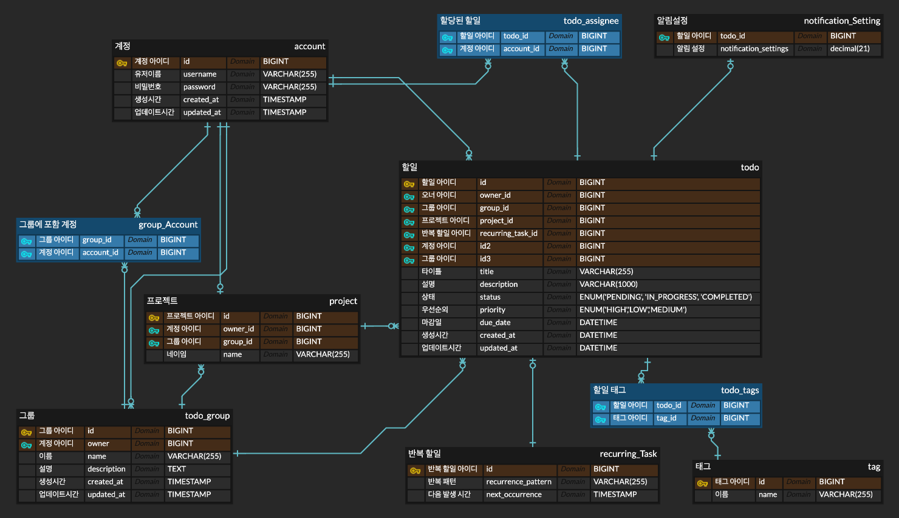

# TODO App

## 기능 목록

### 유저

- 유저 생성: 새로운 사용자를 등록합니다.
- 유저 로그인: 로그인 시 AccessToken 및 RefreshToken을 발급받습니다.
- 유저가 할당된 할일 조회: 유저에게 할당된 할일을 조회합니다.
- 유저가 생성한 할일 조회: 유저가 생성한 할일을 조회합니다.

### 할일

- 할일 생성: 새로운 할일을 생성합니다.
- 할일 수정: 기존 할일의 정보를 수정합니다.
- 할일 삭제: 특정 할일을 삭제합니다.
- 할일 조회: 특정 할일의 상세 정보를 조회합니다.
- 할일 목록 조회:
    - 모든 할일 목록을 조회합니다.
    - 검색 및 필터링 한 할일을 조회합니다.
- 할일 상태 변경: 할일의 상태를 업데이트합니다. (예: 미완료, 진행 중, 완료)
- 할일 분류 및 그룹화: 할일을 태그나 프로젝트 별로 분류하고 그룹화합니다.

### 알림

- 할일 기한 전 알림 설정: 할일 기한이 다가오면 알림을 설정합니다.
- 할일 상태 변경 시 알림: 할일의 완료 또는 상태 변경 시 알림을 보냅니다.
- 할당된 알림: 할일이 할당된 경우 해당 할일에 대해 알림을 설정합니다.
- 반복 할일 설정: 반복적으로 발생하는 할일에 대해 정기적인 알림을 설정합니다.

## 기술 스택

### 프레임워크 및 라이브러리

- Spring Boot 3.3.3: 스프링 기반 애플리케이션을 쉽게 설정하고 실행할 수 있도록 도와줍니다. 내장 서버와 자동 구성을 제공하여 빠른 개발과 배포를 지원합니다.
- Spring Boot Web: REST API 웹 애플리케이션을 구축하는데 사용됩니다. 간편한 REST 서비스 제공 및 처리에 최적화되어 있습니다.
- Java JWT: JSON Web Token 발급 및 인증을 수행합니다. 인증이 주요 목적이 아니기 때문에 간단히 구현할 예정이며 JWT는 널리 사용되는 인증 방법으로 적절한 보안성을 제공합니다.
- Spring Data JPA: 데이터베이스 작업을 쉽게 처리할 수 있도록 ORM을 지원합니다. 데이터 액세스 레이어를 간편하게 관리하고 데이터베이스 작업을 효율적으로 처리할 수 있습니다.

### 테스트

- Junit: 단위 테스트를 실행하는 데 사용됩니다. Java에서 가장 널리 사용되는 테스트 프레임워크로 강력한 테스트 기능을 제공합니다.
- Testcontainers: 테스트용 데이터베이스를 쉽게 실행하는 데 사용됩니다. 데이터베이스를 컨테이너로 실행하여 테스트 환경을 보다 쉽게 설정할 수 있습니다.
- REST Assured: REST API 인수 테스트를 구현하는 데 사용됩니다. REST 웹 서비스를 쉽게 테스트하고 검증할 수 있습니다.
- Spring Boot Test: Spring Boot 애플리케이션의 통합 테스트를 지원하며 테스트 컨텍스트와 종속성 주입을 활용할 수 있습니다.

### 데이터베이스

- MySQL

### 문서화

- Spring restdocs: API를 문서화하는 도구입니다. Swagger와 비교하면 코드에 직접 영향을 미치지 않고 문서화할 수 있고 문서와 코드의 일관성을 유지할 수 있습니다.

### CI/CD

- Git Actions: GitHub와 통합이 잘 되어 있으며 다양한 앱과 플러그인을 지원하여 CI/CD 파이프라인을 편리하게 구현할 수 있습니다. GitHub와의 통합으로 개발과 배포 과정을 자동화하고 효율적으로
  관리할 수 있습니다.

### Infra

- Server: Embedded Tomcat (Spring Boot 내장 서버)를 사용합니다. 내장 서버로 배포 및 테스트가 용이하, 설정이 간편합니다.
- Docker: 환경에 제한하지 않고 서버를 배포할 수 있습니다. 컨테이너화된 애플리케이션을 통해 일관된 실행 환경을 제공하며 배포 및 스케일링이 용이합니다
- AWS Cloud: 가장 널리 사용되는 클라우드 서비스 제공자로 다양한 기능과 높은 안정성을 제공합니다.
    - AWS EC2
    - AWS RDS

### 모니터링

- Spring Boot Actuator: 애플리케이션의 상태를 모니터링하고 관리할 수 있는 도구입니다. 애플리케이션의 메트릭, 로그, 상태 정보를 제공하여 모니터링과 관리 작업을 쉽게 할 수 있습니다.
- prometheus & Grafana: 시스템 메트릭을 모니터링하고 시각화합니다. Prometheus는 메트릭 수집 및 저장을 담당하고 Grafana는 시각화와 대시보드를 제공합니다. 함께 사용하여 효과적인
  모니터링과 분석을 수행할 수 있습니다.

## ERD

> [!TIP]
> 클릭하면 ERDCloud로 넘어갑니다.

## API 설계

### 유저 API

| Endpoint                     | HTTP Method | 설명                                  |
|------------------------------|-------------|-------------------------------------|
| `/users`                     | POST        | 새로운 사용자를 등록합니다.                     |
| `/users/login`               | POST        | AccessToken 및 RefreshToken을 발급받습니다. |
| `/users/{id}/assigend-todos` | GET         | 유저에게 할당된 할일을 조회합니다.                 |
| `/users/{id}/todos`          | GET         | 유저가 생성한 할일을 조회합니다.                  |

### 할일 API

| Endpoint             | HTTP Method | 설명                   |
|----------------------|-------------|----------------------|
| `/todos`             | POST        | 새로운 할일을 생성합니다.       |
| `/todos/{id}`        | PUT         | 기존 할일의 정보를 수정합니다.    |
| `/todos/{id}`        | DELETE	     | 	특정 할일을 삭제합니다.       |
| `/todos/{id}`        | GET         | 특정 할일의 상세 정보를 조회합니다. |
| `/todos/{id}/status` | PUT         | 할일의 상태를 업데이트합니다.     |
| `/todos/{id}/tags`   | PUT         | 할일의 태그를 업데이트합니다.     |

### 그룹 API

| Endpoint             | HTTP Method | 설명                   |
|----------------------|-------------|----------------------|
| `/groups`            | POST        | 새로운 그룹을 생성합니다.       |
| `/groups/{id}`       | PUT         | 기존 그룹의 정보를 수정합니다.    |
| `/groups/{id}`       | DELETE      | 특정 그룹을 삭제합니다.        |
| `/groups/{id}`       | GET         | 특정 그룹의 상세 정보를 조회합니다. |
| `/groups/`           | GET         | 모든 그룹을 조회합니다.        |
| `/groups/{id}/todos` | POST        | 특정 그룹에 할일을 추가합니다.    |
| `/groups/{id}/todos` | DELETE      | 특정 그룹에 속한 할일을 삭제합니다. |
| `/groups/{id}/todos` | GET         | 특정 그룹에 속한 할일을 조회합니다. |

### 알림 API

| Endpoint                | HTTP Method | 설명                   |
|-------------------------|-------------|----------------------|
| `/notifications/`       | GET         | 모든 알림을 가져옵니다.        |
| `/notifications/counts` | GET         | 읽지 않은 알림의 개수를 조회합니다. |
| `/notifications/{id}`   | PUT         | 특정 알림의 상태를 업데이트합니다.  |
| `/notifications/{id}`   | GET         | 특정 알림의 상세 정보를 조회합니다. |

