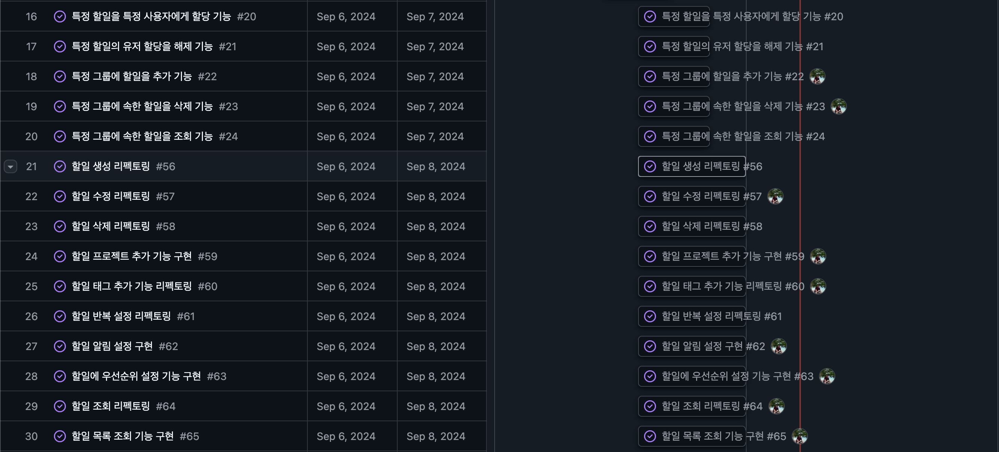
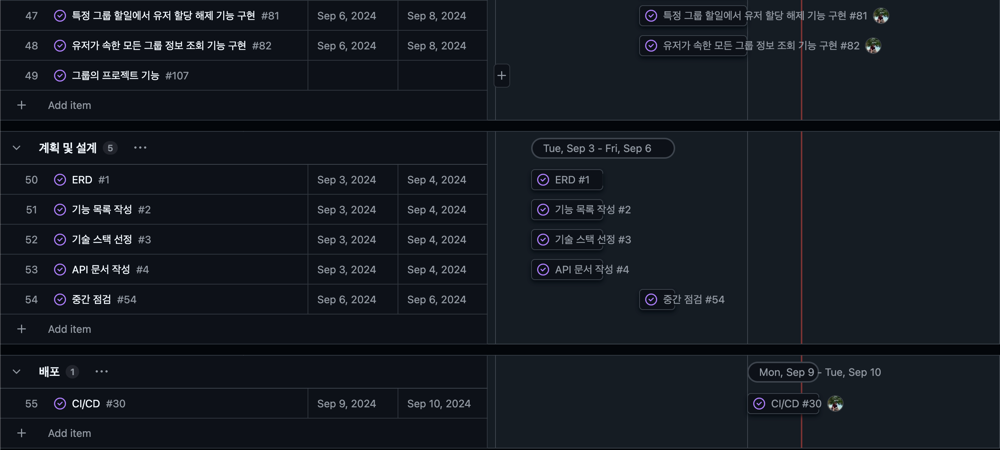

# TODO App

## 기능 목록

### 유저

- [x]  **유저 생성**: 새로운 사용자를 등록할 수 있습니다.
- [x]  **유저 로그인**: 로그인 시 AccessToken 및 RefreshToken을 발급받을 수 있습니다.

---

### 할일 (개인)

- [x]  **할일 생성**: 새로운 할일을 생성할 수 있습니다.
- [x]  **할일 수정**: 기존 할일의 정보를 수정할 수 있습니다.
- [x]  **할일 삭제**: 특정 할일을 삭제할 수 있습니다.
- [ ]  **할일 조회**: 특정 할일의 상세 정보를 조회할 수 있습니다.
- [ ]  **할일 목록 조회**:
    - [ ]  **태그 별**: 태그를 기준으로 할일 목록을 조회할 수 있습니다.
    - [ ]  **프로젝트 별**: 프로젝트를 기준으로 할일 목록을 조회할 수 있습니다.
    - [ ]  **전체**: 모든 할일 목록을 조회할 수 있습니다.
- [ ]  **할일 상태 변경**: 할일의 상태를 업데이트할 수 있습니다. (예: 미완료, 진행 중, 완료)
- [x]  **태그 추가**: 할일에 태그를 추가할 수 있습니다.
- [x]  **태그 삭제**: 할일에서 태그를 삭제할 수 있습니다.
- [ ]  **할일 알림 설정**: 할일 기한 전 알림을 설정할 수 있습니다.
- [x]  **할일 반복 설정**: 할일에 반복 설정을 업데이트할 수 있습니다.
- [x]  **할일 반복 삭제**: 할일에 반복 설정을 삭제할 수 있습니다.

---

### 프로젝트 (개인)

- [x]  **프로젝트 디테일 조회**: 프로젝트 상세 내용을 조회할 수 있습니다.
- [x]  **프로젝트 목록 조회**: 프로젝트 목록을 조회할 수 있습니다.
- [x]  **프로젝트 생성**: 프로젝트 생성할 수 있습니다.
- [x]  **프로젝트 업데이트**: 프로젝트를 업데이트할 수 있습니다.
- [x]  **프로젝트 삭제**: 프로젝트를 삭제할 수 있습니다.
- [x]  **프로젝트에 할일 할당**: 프로젝트에 할일을 할당할 수 있습니다.

---

### TAG

- [x]  **태그 생성**: 태그를 생성할 수 있습니다.
- [x]  **태그 조회**: 태그 이름으로 태그를 조회할 수 있습니다.

---

### 그룹

- [x]  **새로운 그룹 생성**: 새로운 그룹을 생성할 수 있습니다.
- [x]  **기존 그룹 정보 수정**: 기존 그룹의 정보를 수정할 수 있습니다.
- [ ]  **특정 그룹 삭제**: 특정 그룹을 삭제할 수 있습니다.
- [ ]  **특정 그룹 상세 정보 조회**: 특정 그룹의 상세 정보를 조회할 수 있습니다.
- [ ]  **특정 그룹에 포함된 유저 조회**: 특정 그룹에 포함된 유저를 가져올 수 있습니다.
- [ ]  **특정 그룹에 유저 추가**: 특정 그룹에 유저를 추가할 수 있습니다.
- [ ]  **특정 그룹에서 유저 삭제**: 특정 그룹에서 유저를 삭제할 수 있습니다.
- [ ]  **특정 그룹에 할일 추가**: 특정 그룹에 할일을 추가할 수 있습니다.
- [ ]  **특정 그룹에서 할일 삭제**: 특정 그룹에서 할일을 삭제할 수 있습니다.
    - [ ]  **삭제 알림**: 할당된 유저에게 삭제 알림을 보낼 수 있습니다.
- [ ]  **특정 그룹의 할일 수정**: 특정 그룹의 할일을 수정할 수 있습니다.
    - [ ]  **수정 알림**: 할당된 유저에게 수정 사항을 알림으로 보낼 수 있습니다.
- [ ]  **특정 그룹의 할일 상태 변경**: 특정 그룹의 할일 상태를 변경할 수 있습니다.
    - [ ]  **상태 변경 알림**: 할당된 유저에게 상태 변경 알림을 보낼 수 있습니다.
- [ ]  **특정 그룹의 할일 상세 정보 조회**: 특정 그룹의 할일 상세 정보를 조회할 수 있습니다.
- [ ]  **특정 그룹 할일에 태그 추가**: 할일에 태그를 추가할 수 있습니다.
- [ ]  **특정 그룹 할일에서 태그 삭제**: 할일에서 태그를 삭제할 수 있습니다.
- [ ]  **특정 그룹 할일에 프로젝트 업데이트**: 할일의 프로젝트를 업데이트할 수 있습니다.
- [ ]  **특정 그룹 할일 목록 조회**:
    - [ ]  **태그 별**: 태그를 기준으로 할일 목록을 조회할 수 있습니다.
    - [ ]  **프로젝트 별**: 프로젝트를 기준으로 할일 목록을 조회할 수 있습니다.
    - [ ]  **전체**: 모든 할일 목록을 조회할 수 있습니다.
- [ ]  **특정 그룹 할일에 마감 기한 설정**: 마감 기한을 설정할 수 있습니다.
    - [ ]  **마감 기한 알림**: 마감 기한이 가까워지면 할당된 유저에게 알림을 보낼 수 있습니다.
    - [ ]  **마감 기한 변경 알림**: 마감 기한이 변경되면 할당된 유저에게 알림을 보낼 수 있습니다.
- [ ]  **특정 그룹 할일에 우선순위 설정**: 할일의 우선순위를 설정할 수 있습니다.
    - [ ]  **우선순위 설정 알림**: 할당된 유저에게 우선순위 알림을 보낼 수 있습니다.
- [ ]  **그룹 할일 진행률 추적**: 할일의 진행 상태를 비율로 추적할 수 있습니다.
- [ ]  **특정 그룹 할일을 유저에게 할당**: 특정 그룹의 할일을 유저에게 할당할 수 있습니다.
    - [ ]  **할당 알림**: 할일이 할당된 유저에게 알림을 보낼 수 있습니다.
- [ ]  **특정 그룹 할일에서 유저 할당 해제**: 특정 그룹의 할일에서 유저 할당을 해제할 수 있습니다.
    - [ ]  **할당 해제 알림**: 할당이 해제된 유저에게 알림을 보낼 수 있습니다.

---

### 유저의 그룹 정보

- [ ]  **유저가 속한 모든 그룹 정보 조회**: 유저가 속한 모든 그룹 정보를 가져올 수 있습니다.
    - [ ]  **그룹에 포함된 할일도 함께 조회**: 그룹에 포함된 할일도 함께 가져올 수 있습니다.

## 기술 스택

### 프레임워크 및 라이브러리

- Spring Boot 3.3.3: 스프링 기반 애플리케이션을 쉽게 설정하고 실행할 수 있도록 도와줍니다. 내장 서버와 자동 구성을 제공하여 빠른 개발과 배포를 지원합니다.
- Spring Boot Web: REST API 웹 애플리케이션을 구축하는데 사용됩니다. 간편한 REST 서비스 제공 및 처리에 최적화되어 있습니다.
- Java JWT: JSON Web Token 발급 및 인증을 수행합니다. 인증이 주요 목적이 아니기 때문에 간단히 구현할 예정이며 JWT는 널리 사용되는 인증 방법으로 적절한 보안성을 제공합니다.
- Spring Data JPA: 데이터베이스 작업을 쉽게 처리할 수 있도록 ORM을 지원합니다. 데이터 액세스 레이어를 간편하게 관리하고 데이터베이스 작업을 효율적으로 처리할 수 있습니다.
- Lombok: Java의 반복적인 코드 작성 작업을 줄이기 위해 사용합니다.

### 테스트

- Junit: 단위 테스트를 실행하는 데 사용됩니다. Java에서 가장 널리 사용되는 테스트 프레임워크로 강력한 테스트 기능을 제공합니다.
- Testcontainers: 테스트용 데이터베이스를 쉽게 실행하는 데 사용됩니다. 데이터베이스를 컨테이너로 실행하여 테스트 환경을 보다 쉽게 설정할 수 있습니다.
- REST Assured: REST API 인수 테스트를 구현하는 데 사용됩니다. REST 웹 서비스를 쉽게 테스트하고 검증할 수 있습니다.
- Spring Boot Test: Spring Boot 애플리케이션의 통합 테스트를 지원하며 테스트 컨텍스트와 종속성 주입을 활용할 수 있습니다.

### 데이터베이스

- MySQL

### 문서화

- Spring restdocs: API를 문서화하는 도구입니다. Swagger와 비교하면 코드에 직접 영향을 미치지 않고 문서화할 수 있고 문서와 코드의 일관성을 유지할 수 있습니다.

### CI/CD

- Git Actions: GitHub와 통합이 잘 되어 있으며 다양한 앱과 플러그인을 지원하여 CI/CD 파이프라인을 편리하게 구현할 수 있습니다. GitHub와의 통합으로 개발과 배포 과정을 자동화하고 효율적으로
  관리할 수 있습니다.

### Infra

- Server: Embedded Tomcat (Spring Boot 내장 서버)를 사용합니다. 내장 서버로 배포 및 테스트가 용이하, 설정이 간편합니다.
- Docker: 환경에 제한하지 않고 서버를 배포할 수 있습니다. 컨테이너화된 애플리케이션을 통해 일관된 실행 환경을 제공하며 배포 및 스케일링이 용이합니다
- AWS Cloud: 가장 널리 사용되는 클라우드 서비스 제공자로 다양한 기능과 높은 안정성을 제공합니다.
    - AWS EC2
    - AWS RDS

### 모니터링

- Spring Boot Actuator: 애플리케이션의 상태를 모니터링하고 관리할 수 있는 도구입니다. 애플리케이션의 메트릭, 로그, 상태 정보를 제공하여 모니터링과 관리 작업을 쉽게 할 수 있습니다.
- prometheus & Grafana: 시스템 메트릭을 모니터링하고 시각화합니다. Prometheus는 메트릭 수집 및 저장을 담당하고 Grafana는 시각화와 대시보드를 제공합니다. 함께 사용하여 효과적인
  모니터링과 분석을 수행할 수 있습니다.

## ERD

> [!TIP]
> [클릭하면 ERDCloud로 넘어갑니다.](https://www.erdcloud.com/d/g7iKqHQtHMdXrKiEu)

## API 설계

### 유저 API

| Endpoint       | HTTP Method | 설명                                  | 상태 |
|----------------|-------------|:------------------------------------|----|
| `/users`       | POST        | 새로운 사용자를 등록합니다.                     | ✅  |
| `/users/login` | POST        | AccessToken 및 RefreshToken을 발급받습니다. | ✅  |

---

### 할일 API (개인인증 필요)

| Endpoint                      | HTTP Method | 설명                         | 상태 |
|-------------------------------|-------------|----------------------------|----|
| `/todos`                      | POST        | 새로운 할일을 생성합니다.             | ✅  |
| `/todos/{id}`                 | PUT         | 기존 할일의 정보를 수정합니다.          | ✅  |
| `/todos/{id}`                 | DELETE      | 특정 할일을 삭제합니다.              | ✅  |
| `/todos/{id}`                 | GET         | 특정 할일의 상세 정보를 조회합니다.       |    |
| `/todos`                      | GET         | 전체 할일 목록을 조회합니다.           |    |
| `/todos?tag={tagName}`        | GET         | 태그 별로 할일 목록을 조회합니다.        |    |
| `/todos?project={projectId}`  | GET         | 프로젝트 별로 할일 목록을 조회합니다.      |    |
| `/todos/{id}/status`          | PUT         | 특정 할일의 상태를 업데이트합니다.        |    |
| `/todos/{id}/tags`            | PUT         | 특정 할일에 태그를 추가합니다.          | ✅  |
| `/todos/{id}/tags/{id}`       | DELETE      | 특정 할일에 태그를 삭제합니다.          | ✅  |
| `/todos/{id}/recurring-tasks` | PUT         | 특정 할일에 대해 반복 설정을 업데이트 합니다. | ✅  |
| `/todos/{id}/recurring-tasks` | DELETE      | 특정 할일의 반복 설정을 삭제합니다.       | ✅  |
| `/todos/{id}/assign`          | POST        | 특정 할일을 특정 사용자에게 할당합니다.     |    |
| `/todos/{id}/assign`          | DELETE      | 특정 할일의 할당을 해제합니다.          |    |
| `/todos/{id}/notifications`   | POST        | 특정 할일의 기한 전 알림을 설정합니다.     |    |
| `/todos/{id}/notifications`   | PUT         | 특정 할일의 알림을 수정합니다.          |    |
| `/todos/{id}/notifications`   | DELETE      | 특정 할일의 알림을 삭제합니다.          |    |
| `/todos/{id}/notifications`   | GET         | 특정 할일의 알림을 조회합니다.          |    |

---

### 개인 프로젝트 API (개인 인증 필요)

| Endpoint               | HTTP Method | 설명                 | 상태 |
|------------------------|-------------|--------------------|----|
| `/projects/{id}`       | GET         | 프로젝트의 디테일 조회합니다.   | ✅  |
| `/projects`            | GET         | 개인 프로젝트 목록을 조회합니다. | ✅  |
| `/projects`            | POST        | 프로젝트을 생성합니다.       | ✅  |
| `/projects/{id}`       | PUT         | 프로젝트를 수정합니다.       | ✅  |
| `/projects/{id}`       | DELETE      | 프로젝트를 삭제합니다.       | ✅  |
| `/projects/{id}/todos` | PUT         | 프로젝트에 할일을 할당합니다.   | ✅  |

---

### 태그 API

| Endpoint            | HTTP Method | 설명                | 상태 |
|---------------------|-------------|-------------------|----|
| `/tags`             | POST        | 새로운 태그를 생성합니다.    | ✅  |
| `/tags?name={name}` | GET         | 태그이름으로 태그를 조회합니다. | ✅  |

---

### 그룹 API (그룹인증 필요)

| Endpoint                                 | HTTP Method | 설명                               | 상태 |
|------------------------------------------|-------------|----------------------------------|----|
| `/groups`                                | POST        | 새로운 그룹을 생성할 수 있습니다.              |    |
| `/groups/{id}`                           | PUT         | 기존 그룹의 정보를 수정할 수 있습니다.           |    |
| `/groups/{id}`                           | DELETE      | 특정 그룹을 삭제할 수 있습니다.               |    |
| `/groups/{id}`                           | GET         | 특정 그룹의 상세 정보를 조회할 수 있습니다.        |    |
| `/groups/{id}/users`                     | GET         | 특정 그룹에 포함된 유저를 가져올 수 있습니다.       |    |
| `/groups/{id}/users`                     | POST        | 특정 그룹에 유저를 추가할 수 있습니다.           |    |
| `/groups/{id}/users/{userId}`            | DELETE      | 특정 그룹에서 유저를 삭제할 수 있습니다.          |    |
| `/groups/{id}/todos`                     | POST        | 특정 그룹에 할일을 추가할 수 있습니다.           |    |
| `/groups/{id}/todos/{todoId}`            | DELETE      | 특정 그룹에서 할일을 삭제할 수 있습니다.          |    |
| `/groups/{id}/todos/{todoId}`            | PUT         | 특정 그룹의 할일을 수정할 수 있습니다.           |    |
| `/groups/{id}/todos/{todoId}/status`     | PUT         | 특정 그룹의 할일 상태를 변경할 수 있습니다.        |    |
| `/groups/{id}/todos/{todoId}`            | GET         | 특정 그룹의 할일 상세 정보를 조회할 수 있습니다.     |    |
| `/groups/{id}/todos/{todoId}/tags`       | POST        | 특정 그룹의 할일에 태그를 추가할 수 있습니다.       |    |
| `/groups/{id}/todos/{todoId}/tags`       | DELETE      | 특정 그룹의 할일에서 태그를 삭제할 수 있습니다.      |    |
| `/groups/{id}/todos/{todoId}/projects`   | PUT         | 특정 그룹의 할일을 프로젝트 별로 분류할 수 있습니다.   |    |
| `/groups/{id}/todos?tag={tagName}`       | GET         | 특정 그룹의 할일을 태그 별로 조회할 수 있습니다.     |    |
| `/groups/{id}/todos?project={projectId}` | GET         | 특정 그룹의 할일을 프로젝트 별로 조회할 수 있습니다.   |    |
| `/groups/{id}/todos`                     | GET         | 특정 그룹의 모든 할일 목록을 조회할 수 있습니다.     |    |
| `/groups/{id}/todos/{todoId}/due-date`   | PUT         | 특정 그룹의 할일에 마감 기한을 설정할 수 있습니다.    |    |
| `/groups/{id}/todos/{todoId}/priority`   | PUT         | 특정 그룹의 할일에 우선순위를 설정할 수 있습니다.     |    |
| `/groups/{id}/todos/progress`            | GET         | 특정 그룹의 할일 진행 상태를 비율로 추적할 수 있습니다. |    |
| `/groups/{id}/todos/{todoId}/assign`     | POST        | 특정 그룹의 할일을 유저에게 할당할 수 있습니다.      |    |
| `/groups/{id}/todos/{todoId}/assign`     | DELETE      | 특정 그룹의 할일에서 유저 할당을 해제할 수 있습니다.   |    |

---

### 유저의 그룹 정보 API (그룹인증 필요)

| Endpoint                 | HTTP Method | 설명                           | 상태 |
|--------------------------|-------------|------------------------------|----|
| `/users/{userId}/groups` | GET         | 유저가 속한 모든 그룹 정보를 가져올 수 있습니다. |    |
| `/users/{userId}/groups` | GET         | 그룹에 포함된 할일도 함께 가져올 수 있습니다.   |    |

## WBS

> [!TIP]
> [클릭하면 WBS로 넘어갑니다.](https://github.com/users/AlbertImKr/projects/7/views/1)

